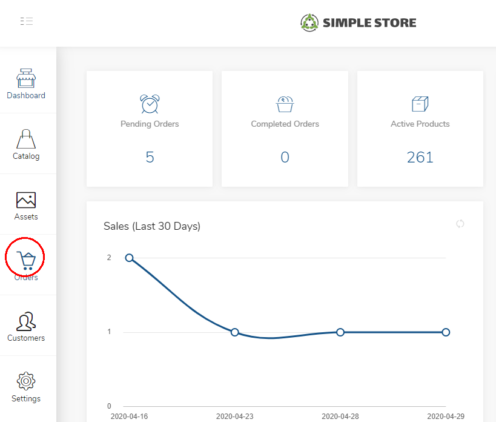

# Collections

A collection represents a broad logical grouping of products.

Examples of collections could be:

* Winter Collection
* Premium Collection

### View Collections

Assess the **Collection** screen in the console via the console navigation bar.

### Add New Collection

Click **Add New** to create a new collection

Specified a Name and Description for the collection.

Click **Submit** to create the new collection.

### Edit Collection

Additional **Collection Details** can be specified including:

#### Collection Properties

| Element | Description |
| :--- | :--- |
| Collection Id | Internal Identifier for the collection |
| Name | Name of the collection |
| Slug | A Url slug to accese the collection |
| Description | A Description for the collection |
| Attributes | One or more key/value pairs |

Click **Save** to commit your modifications.

